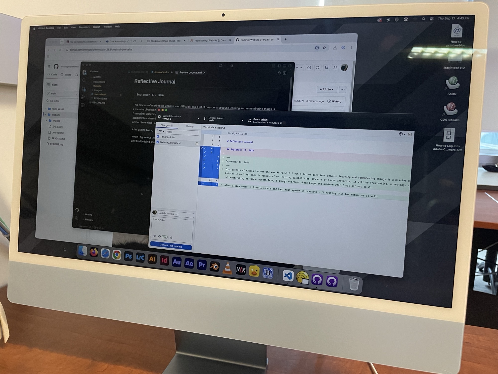

# Reflective Journal

~~~
September 17, 2026
~~~
This process of making the website was difficult! I ask a lot of questions because learning and remembering things is a massive obstical in my life becuase of my learning disabilities. Since I have to deal with my disibalities, it will be frustrating, upsetting, and unmotivating at times when I do work. I end up crying and being stressed out at the end of assignemtns when they are time consuming, hard, and when I am tired.
 Nonetheless, I always overcome these bumps and achieve what I was set out to do.

After asking twice, I finally understood that this *path* is brackets . /! Writing this for future me as well.
I also know that to link an image i just use this !

When I figure out these things, it makes me feel real good about myself. All my life i've been the "dumb kid" in classes and finally doing something I find challenging or difficult really boosts my confidence.

---

